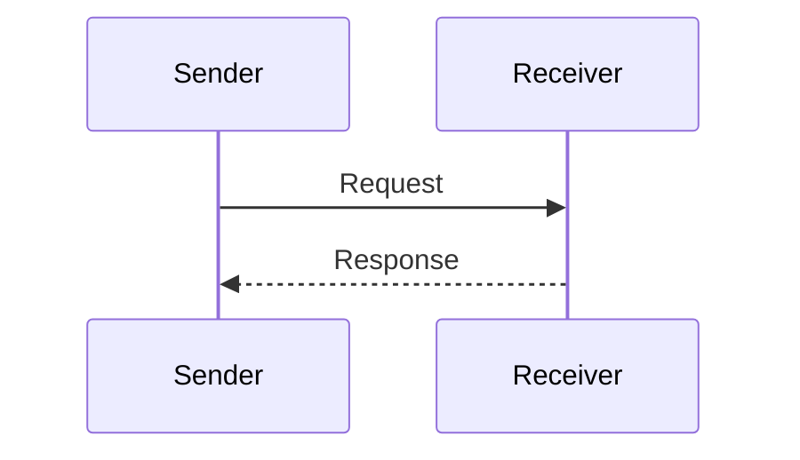
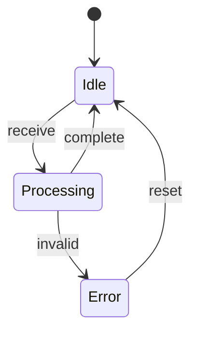
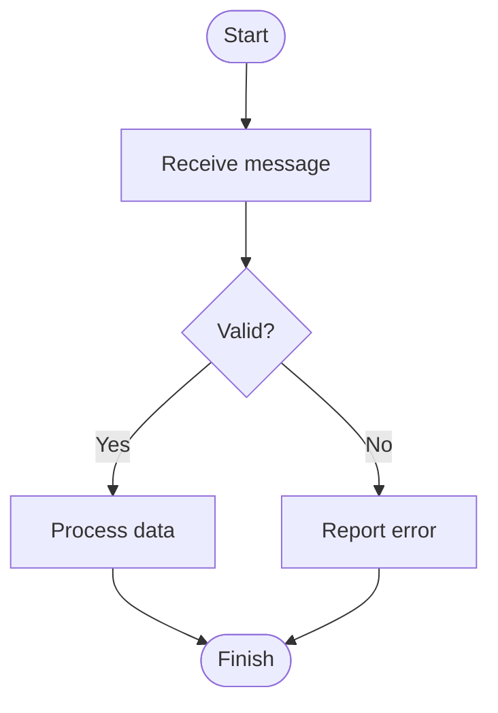

# CFCS_IDL

## 인터페이스 개요

이 IDL의 목적과 메시지 흐름을 작성하세요.

## Sequence Diagram

```mermaid
sequenceDiagram
    participant A as Sender
    participant B as Receiver
    A->>B: Request
    B-->>A: Response
```

## State Machine Diagram

```mermaid
stateDiagram-v2
    [*] --> Idle
    Idle --> Processing: receive
    Processing --> Idle: complete
    Processing --> Error: invalid
    Error --> Idle: reset
```

## Activity Diagram

```mermaid
flowchart TD
    Start([Start]) --> Receive[Receive message]
    Receive --> Valid{Valid?}
    Valid -->|Yes| Process[Process data]
    Valid -->|No| Reject[Report error]
    Process --> Finish([Finish])
    Reject --> Finish
```
